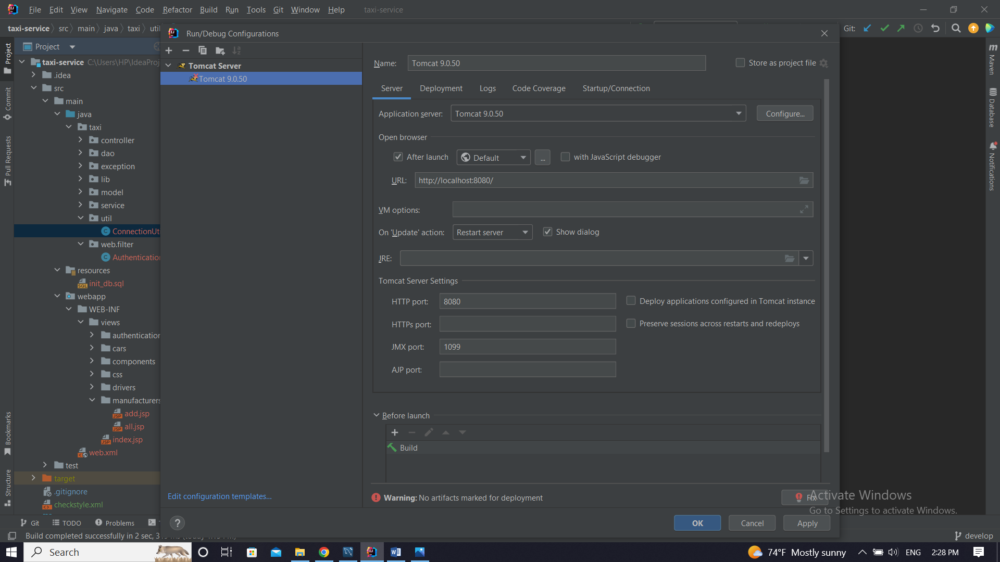
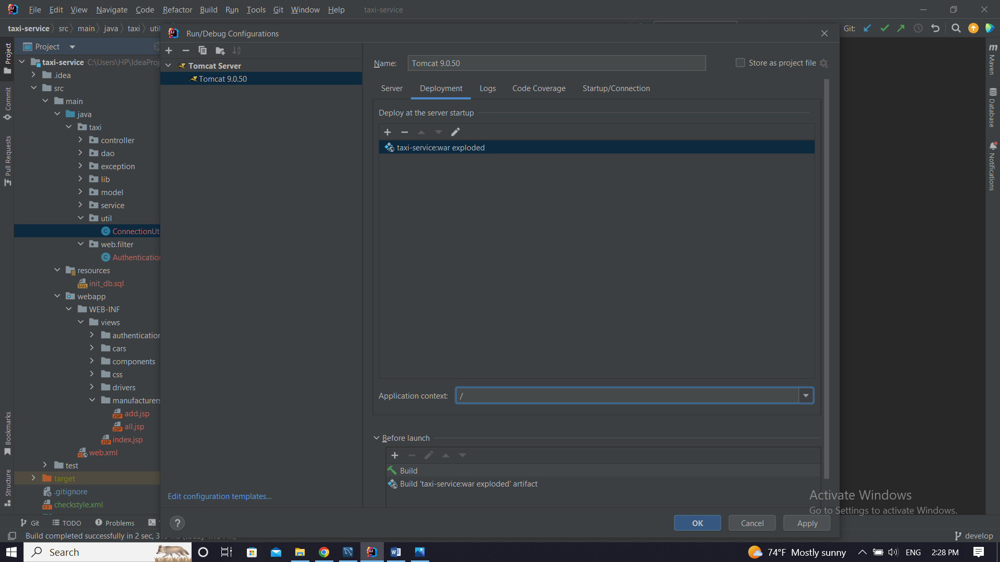

#  🎬 Cinema App  🎬

### ⚡️ Functionality
#### Cinema app offers the following functionality:
Admin interface: 🎫

* Cinema halls, movies, movie sessions, users management: creating, retrieving a list of all halls and movies,
  creating, updating, deletion, retrieving a list of all available movie sessions, retrieving user info by email

User interface:  🎟️

* Cinema halls, movies, movie sessions, orders, shopping-cart management:
user can retrieve common information about cinema halls, movies, available movie sessions, own orders and shopping-cart.
Customer also can add necessary movie session to own shopping cart and complete orders

# 📝 Project Structure
Cinema app project follows a three-tier architecture with the following structure:

* Controller: Handles incoming requests from user and admin and invokes the appropriate service methods.

* Service: Implements the business logic of the application and interacts with the DAO layer.

* DAO: Transfers requests from the service layer to the database, and executes SQL queries.

* Project also has logic of identification, authentication, authorization, filtration and encoding 
realized by Spring which provides additional security of user data

## 🎯 Endpoints 🎯

#### Admin 🎫
- POST:   /register
- POST:   /cinema-halls 
- POST:   /movies
- POST:   /movie-sessions 
- PUT:    /movie-sessions/{id} 
- DELETE: /movie-sessions/{id} 
- GET:    /users/by-email
- GET:    /cinema-halls
- GET:    /movies
- GET:    /movie-sessions/available

#### User  🎟️
- POST: /register
- GET:  /cinema-halls
- GET:  /movies
- GET:  /orders
- GET:  /movie-sessions/available
- GET:  /shopping-carts/by-user
- POST: /orders/complete
- PUT:  /shopping-carts/movie-sessions

# 🧬 Technologies Used
* Java 17
* Spring 5.3.20
* Spring Web 5.3.20
* Spring Security 5.6.10
* Hibernate 5.6.14.Final
* MySQL 8.0.22
* Apache Tomcat 9.0.50
* Maven 3.1.1

## 🚀 Instructions for project running
1. Clone this project from GitHub
2. To deploy this project you need to install Apache Tomcat web server. 
3. It's better to use 9.0.50 version which you can download [here](https://tomcat.apache.org/download-90.cgi). After installation, you can set up necessary configurations and fix Tomcat by selecting the artifact to deploy taxi-service:war exploded. It's also better to remove the Application context taxi_service_war exploded to /
   
   
3. Set up MySQL database 8 version or higher. 
In the db.properties file fill with the appropriate info following fields to create connection with database:
* db.driver: you database driver

* db.url: the URL of your database, including host, port, db name and additional parameters.

* db.user: your accessing username

* db.password: your accessing password

4. Install Postman to send post, put and delete requests. After this you can run your project

